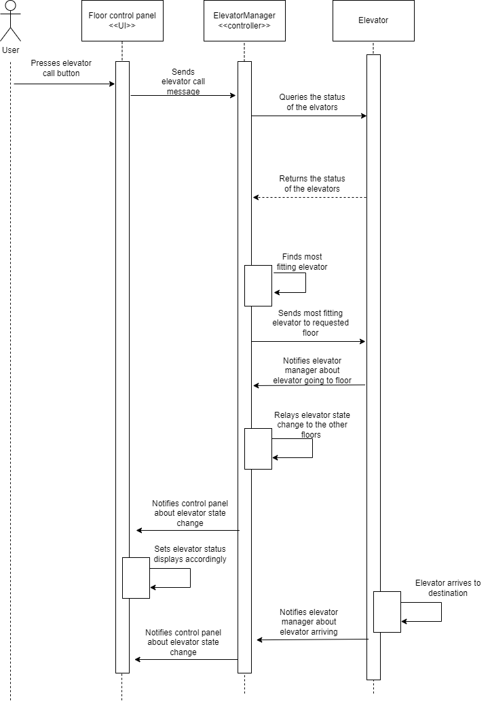
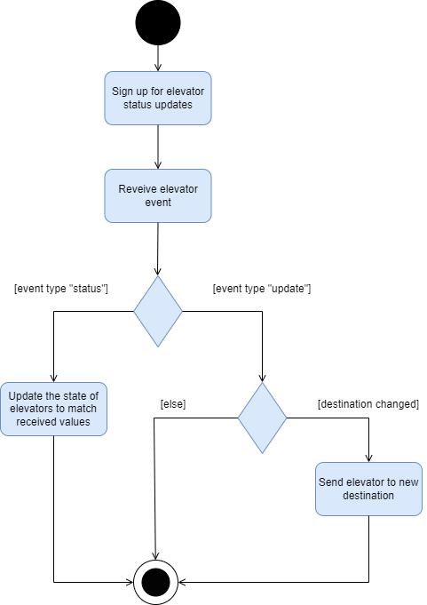

# Diagrams

## Sequence diagram

The sequence diagram belows illustrates how a user's elevator call gets processed.

## Activity diagram

The activity diagram below illustrates how the events triggered by the elevator change get processed by the frontend.

